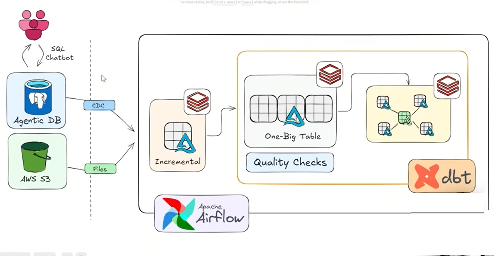

# 🛒 Walmart Data Engineering End-to-End Project

> **A production-grade, modern data engineering pipeline built on Apache Airflow, dbt, and Databricks — ingesting real-world Walmart retail data through a fully orchestrated medallion architecture with CDC, incremental loading, SCD Type 2, STAR schema modeling, and automated quality checks.**

---



---

## 📋 Table of Contents

- [Project Overview](#-project-overview)
- [Business Problem](#-business-problem)
- [Solution Summary](#-solution-summary)
- [Data Sources](#-data-sources)
- [Transformation Layer](#-transformation-layer)
- [Storage Layer](#-storage-layer)
- [Reporting Layer](#-reporting-layer)
- [Tools & Tech Stack](#-tools--tech-stack)
- [Project Structure](#-project-structure)
- [Getting Started](#-getting-started)
- [Pipeline Execution Flow](#-pipeline-execution-flow)

---

## 🔭 Project Overview

This project simulates a **real-world retail data platform** for a large-scale enterprise like Walmart. It demonstrates how a modern data engineering team would design, build, and maintain a fully orchestrated data pipeline — from raw source ingestion all the way to analytics-ready STAR schema models.

The platform handles **two distinct ingestion patterns**:
- **Change Data Capture (CDC)** from a transactional PostgreSQL database (Agentic DB) — capturing inserts, updates, and deletes in near real time
- **File-based ingestion** from AWS S3 — processing structured flat files (CSV/Parquet) delivered by upstream teams

The entire pipeline is **orchestrated by Apache Airflow**, **transformed by dbt**, and **computed on Databricks** — with Delta Lake as the unified storage format throughout the medallion architecture.

A **SQL Chatbot layer** sits on top of the platform, enabling business users to query the Agentic DB directly via natural language — demonstrating the convergence of AI-assisted analytics and traditional BI.

---

## 🧩 Business Problem

Walmart generates millions of transactional records daily across its global retail operations — spanning sales, inventory, supply chain, and customer interactions. Historically, these data streams were siloed across:

- **Operational databases** handling point-of-sale and order management
- **Flat file exports** from third-party vendors, logistics systems, and store-level batch uploads
- **Manual reporting** that couldn't keep pace with the volume or velocity of data changes

This created several critical pain points:

| Problem | Business Impact |
|---|---|
| No unified view of sales and inventory | Stockouts and overstock costing millions per quarter |
| Stale reports (T+2 or T+3 lag) | Late decisions on promotions, pricing, and supply chain |
| No historical tracking of dimension changes | Inability to audit price changes, store reclassifications, or product category shifts |
| Brittle, manually-run ETL scripts | Pipeline failures with no alerting or recovery strategy |
| Data quality issues surfaced only in BI tools | Downstream dashboards showing incorrect KPIs |

---

## ✅ Solution Summary

The platform addresses every pain point above through a modern, layered data architecture:

```
Sources → Ingestion (CDC + Files) → Bronze (Raw) → Silver (Cleaned + Incremental) → Gold (STAR Schema + dbt) → Reporting
```

**Key capabilities delivered:**

- **Incremental ingestion** ensures only new or changed records are processed — reducing compute cost and pipeline runtime by orders of magnitude compared to full reloads
- **CDC from PostgreSQL** captures every row-level change in the operational database without impacting source system performance
- **SCD Type 2** on dimension tables (products, stores, customers) provides a complete audit trail of all historical changes
- **Metadata-driven pipelines** — table configs, watermark columns, and ingestion parameters are driven by config tables, not hardcoded logic, enabling new datasets to be onboarded without code changes
- **dbt models** enforce consistent business logic, column-level lineage, and automated testing across all Gold layer tables
- **Quality Checks** at the Silver layer gate bad data before it contaminates the Gold layer
- **Apache Airflow DAGs** orchestrate every step end-to-end with retries, alerting, and dependency management

---

## 📦 Data Sources

### 1. Agentic DB (PostgreSQL — via CDC)
The primary operational database simulating Walmart's transactional backend.

| Table | Description |
|---|---|
| `orders` | Customer purchase orders with line items, quantities, store, and timestamps |
| `customers` | Customer master data including demographics and loyalty tier |
| `stores` | Store metadata — location, format (supercenter, neighborhood market), region |
| `products` | Product catalog including SKU, category hierarchy, supplier |
| `inventory` | Real-time inventory levels per SKU per store |

**Ingestion method:** Debezium-style CDC events streamed into the Bronze layer, capturing `INSERT`, `UPDATE`, and `DELETE` operations with full before/after row images.

---

### 2. AWS S3 (File-Based Ingestion)
Flat files delivered to designated S3 prefixes by upstream systems and third-party partners.

| File Type | Description |
|---|---|
| `sales_transactions_*.parquet` | Daily aggregated sales by store and product |
| `vendor_invoices_*.csv` | Vendor supply and invoice records |
| `store_promotions_*.csv` | Promotional events and discount schedules by store |
| `returns_*.csv` | Customer return and refund records |

**Ingestion method:** Airflow sensors monitor S3 prefixes for new file arrivals and trigger incremental loads with watermark-based deduplication.

---

## ⚙️ Transformation Layer

Transformations follow a **medallion architecture** (Bronze → Silver → Gold) with clear contracts at each layer boundary.

### 🥉 Bronze Layer — Raw Ingestion
- Data landed **as-is** from source systems — no transformations applied
- Preserves full source fidelity including malformed records
- Schema-on-read using Delta Lake auto-schema evolution
- Partitioned by `ingestion_date` for efficient downstream filtering

### 🥈 Silver Layer — Cleansed & Enriched
- **Incremental merge** using `MERGE INTO` on Delta tables — idempotent and safe to re-run
- **Data Quality Checks** enforced via dbt tests and custom Great Expectations assertions:
  - Not-null checks on primary keys and business-critical columns
  - Referential integrity checks (orders → customers, orders → products)
  - Range checks (quantities > 0, prices within valid bounds)
  - Duplicate detection via row hashing
- Records **failing quality checks** are quarantined to a `rejected_records` table with failure reason codes — never silently dropped
- **SCD Type 2** applied to `dim_customers`, `dim_products`, and `dim_stores` — tracking `valid_from`, `valid_to`, and `is_current` flags

### 🥇 Gold Layer — Analytics-Ready (dbt)
- **STAR Schema** modeled in dbt with clearly defined fact and dimension tables:

```
fact_sales
├── dim_customer (SCD2)
├── dim_product (SCD2)
├── dim_store (SCD2)
├── dim_date
└── dim_promotion
```

- All business logic centralized in dbt models — no logic in BI tools
- dbt **tests** run on every model deployment: unique, not_null, accepted_values, relationships
- dbt **documentation** auto-generated and served via dbt docs serve
- **Incremental dbt models** (`is_incremental()`) used on all fact tables — only appending new records per run

---

## 🗄️ Storage Layer

| Layer | Format | Location | Retention |
|---|---|---|---|
| Bronze | Delta Lake (Parquet + transaction log) | AWS S3 / Databricks DBFS | 90 days raw |
| Silver | Delta Lake with Z-ordering on join keys | Databricks Unity Catalog | 2 years |
| Gold | Delta Lake (dbt-managed) | Databricks Unity Catalog | Indefinite |
| Rejected Records | Delta Lake | Databricks Unity Catalog | 30 days |

**Delta Lake** is used uniformly across all layers, providing:
- ACID transactions and concurrent read/write safety
- Time travel for point-in-time recovery and auditing
- Schema enforcement and evolution controls
- Vacuum and optimize operations managed by Airflow maintenance DAGs

---

## 📊 Reporting Layer

The Gold layer feeds two downstream consumers:

### 1. BI / Analytics Dashboards
Gold layer Delta tables are exposed via **Databricks SQL warehouses** to BI tools (e.g., Power BI, Tableau, Looker), enabling:
- Real-time sales performance by store, region, product category
- Inventory turnover and stockout analysis
- Customer cohort analysis and loyalty segmentation
- Promotion effectiveness and margin impact

### 2. SQL Chatbot (AI-Assisted Analytics)
A **natural language SQL interface** sits on top of the Agentic DB, allowing non-technical business users to ask questions in plain English and receive SQL-generated answers — bridging the gap between data engineering and self-service analytics.

---

## 🛠️ Tools & Tech Stack

| Category | Tool / Service | Purpose |
|---|---|---|
| **Orchestration** | Apache Airflow | DAG scheduling, dependency management, retries, alerting |
| **Transformation** | dbt (Data Build Tool) | SQL-based transformations, testing, documentation, lineage |
| **Compute** | Databricks (Apache Spark) | Distributed processing for incremental loads, CDC merges, SCD logic |
| **Storage** | Delta Lake | ACID-compliant lakehouse storage across all medallion layers |
| **Cloud Storage** | AWS S3 | Raw file landing zone and Bronze layer object storage |
| **Source DB** | PostgreSQL (Agentic DB) | Operational transactional database with CDC enabled |
| **CDC** | Debezium / Databricks Autoloader | Capturing row-level changes from PostgreSQL |
| **Data Quality** | dbt tests + Great Expectations | Schema, freshness, and business rule validation |
| **AI Layer** | SQL Chatbot (LLM-powered) | Natural language to SQL interface on Agentic DB |
| **Language** | Python / SQL / PySpark | Pipeline logic, transformations, and ad-hoc analysis |
| **Version Control** | GitHub | Source control, CI/CD triggers for dbt model deployments |

---

## 🗂️ Project Structure

```
walmart-de-project/
│
├── airflow/
│   ├── dags/
│   │   ├── ingestion/
│   │   │   ├── cdc_postgres_to_bronze.py       # CDC pipeline DAG
│   │   │   └── s3_files_to_bronze.py           # File-based ingestion DAG
│   │   ├── transformation/
│   │   │   ├── bronze_to_silver.py             # Incremental merge + quality checks
│   │   │   └── silver_to_gold_dbt.py           # dbt run trigger DAG
│   │   └── maintenance/
│   │       └── delta_optimize_vacuum.py        # Table maintenance DAG
│   └── plugins/
│
├── databricks/
│   ├── notebooks/
│   │   ├── ingestion/
│   │   │   ├── cdc_merge.py                    # SCD Type 2 merge logic
│   │   │   └── incremental_file_load.py        # Watermark-based file ingestion
│   │   └── quality/
│   │       └── dq_checks.py                    # Data quality assertion runner
│   └── configs/
│       └── ingestion_metadata.csv              # Metadata-driven pipeline config
│
├── dbt/
│   ├── models/
│   │   ├── staging/                            # Raw → typed, renamed
│   │   ├── intermediate/                       # Business logic joins
│   │   └── marts/
│   │       ├── core/
│   │       │   ├── fact_sales.sql
│   │       │   ├── dim_customer.sql            # SCD2
│   │       │   ├── dim_product.sql             # SCD2
│   │       │   └── dim_store.sql               # SCD2
│   │       └── reporting/
│   │           ├── rpt_sales_by_store.sql
│   │           └── rpt_inventory_health.sql
│   ├── tests/
│   ├── macros/
│   └── dbt_project.yml
│
├── sql_chatbot/
│   ├── app.py                                  # LLM-powered NL-to-SQL interface
│   └── schema_context.json                     # Table/column descriptions for LLM context
│
├── docs/
│   └── architecture.png
│
├── .github/
│   └── workflows/
│       └── dbt_ci.yml                          # dbt test on PR
│
└── README.md
```

---

## 🚀 Getting Started

### Prerequisites
- Databricks workspace with Unity Catalog enabled
- AWS account with S3 bucket configured
- PostgreSQL instance with logical replication enabled (`wal_level = logical`)
- Apache Airflow 2.7+ (MWAA or self-hosted)
- dbt Core 1.7+ with `dbt-databricks` adapter

### Environment Setup

```bash
# Clone the repository
git clone https://github.com/your-username/walmart-de-project.git
cd walmart-de-project

# Install dbt dependencies
cd dbt
pip install dbt-databricks
dbt deps

# Configure Airflow connections
# Add these in Airflow UI → Admin → Connections:
#   - databricks_default (Databricks REST API token)
#   - aws_default (S3 access)
#   - postgres_agentic_db (PostgreSQL connection)

# Run dbt models
dbt run --target prod
dbt test --target prod
```

---

## 🔄 Pipeline Execution Flow

```
[Airflow Scheduler]
       │
       ├──► CDC Sensor (PostgreSQL Agentic DB)
       │         └──► Debezium captures row changes
       │                   └──► Bronze Delta table (append)
       │                             └──► Silver MERGE (SCD2 + Quality Gate)
       │
       ├──► S3 File Sensor (AWS S3)
       │         └──► New file detected
       │                   └──► Autoloader incremental load
       │                             └──► Bronze Delta table (append)
       │                                       └──► Silver MERGE (dedup + QC)
       │
       └──► dbt Run Trigger (after Silver completes)
                 └──► Staging models
                           └──► Intermediate models
                                     └──► Mart models (fact + dims)
                                               └──► BI Tools / SQL Chatbot
```

---

## 🧠 Key Engineering Patterns Demonstrated

| Pattern | Where Applied |
|---|---|
| **Incremental Ingestion** | Bronze → Silver MERGE using watermark columns |
| **Metadata-Driven Pipelines** | `ingestion_metadata.csv` drives table configs dynamically |
| **SCD Type 2** | `dim_customer`, `dim_product`, `dim_store` |
| **STAR Schema** | Gold layer: `fact_sales` + conformed dimensions |
| **Idempotency** | All `MERGE INTO` operations are safe to re-run |
| **Data Quality Gates** | Silver layer quarantines bad records before Gold |
| **CDC** | PostgreSQL logical replication → Bronze Delta |
| **One-Big-Table (OBT)** | Pre-aggregated wide table for high-performance BI queries |

---

## 📄 License

This project is built for educational and portfolio purposes using publicly available Walmart datasets. All pipeline patterns and architecture are original implementations by the author.

---

> Built with ❤️ by **Nelson** — Senior Data Engineer  
> *Tech Stack: Apache Airflow · dbt · Databricks · AWS S3 · Delta Lake · PostgreSQL · PySpark*
